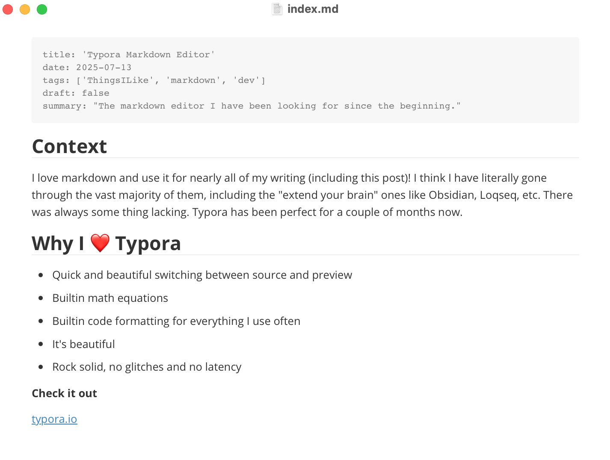
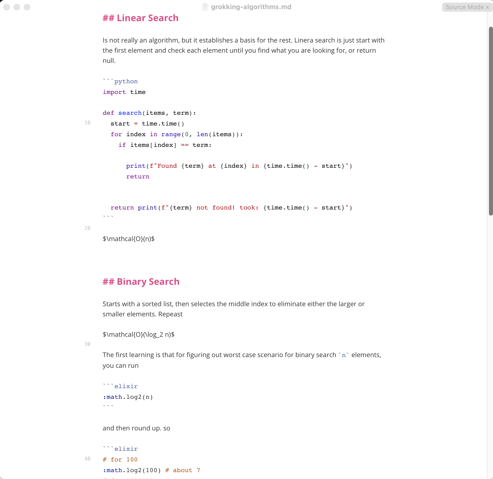
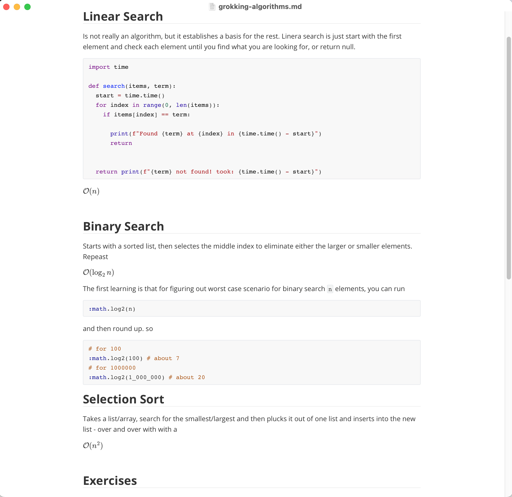

## Context

I love markdown and use it for nearly all of my writing (including this post)! I think I have literally gone through the vast majority of them, including the "extend your brain" ones like Obsidian, Loqseq, etc. There was always some thing lacking. Typora has been perfect for a couple of months now.

## Why I ❤️ Typora

- Quick and beautiful switching between source and preview
- Builtin math equations
- Builtin code formatting for everything I use often
- It's beautiful
- Rock solid, no glitches and no latency

**Check it out**

[typora.io](https://typora.io/)

## A few screenshots

### This post in typora

### Typical notes source mode

### Typical notes source mode

