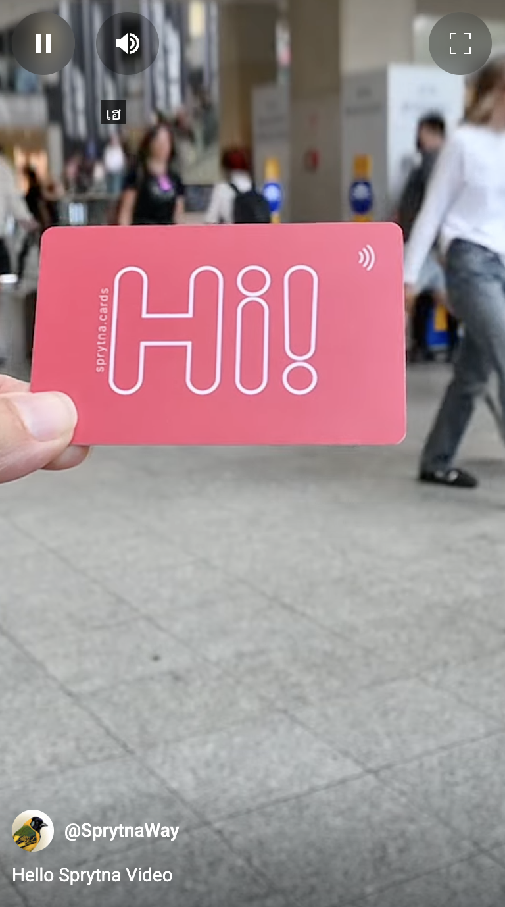

## We'll Figure It Out

Borrowing an ISM from the [Rocket Companies](https://www.rocketcompanies.com/who-we-are/our-philosophies/): *"We'll figure it out."* I know some things — and I trust myself to learn the rest.

I also believe the best way to get better at something is to do more of it, reflecting on each iteration. I'm now on video #3 (and yeah, it shows). But with every round, I’m learning: camera setup, Adobe Premiere Pro, editing, soundtracks, even starting to think about story.

There are setbacks and wasted time along the way — totally normal. As they say: *“Do what you can with what you’ve got.”* That includes whatever knowledge you currently have. The fastest way to grow it is to keep doing the work.

[Watch on youtube](https://youtube.com/shorts/kd3huRp8lPs?feature=share)

