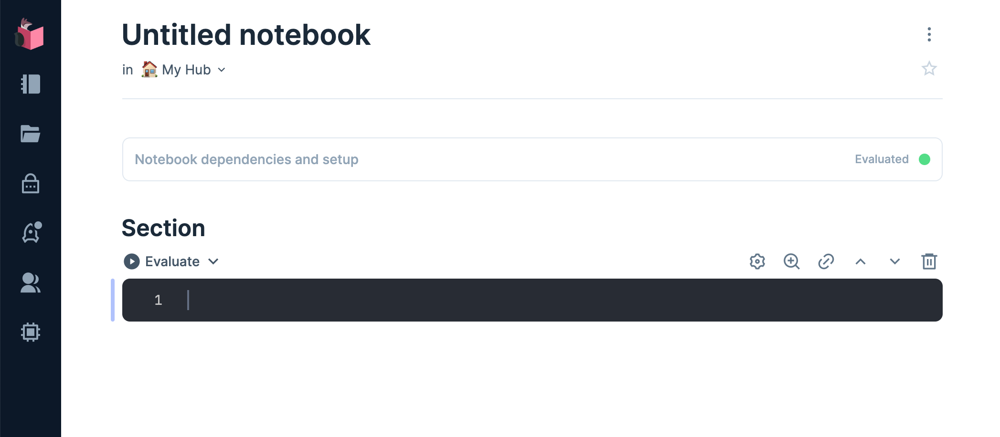

+++
title = 'First Hops With RabbitMQ'
date = 2024-04-30T07:14:42+02:00
tags = ['dev', 'rabbitmq', 'elixir', 'node', 'docker']
draft = false
summary = "Just starting with RabbitMQ? This introductory guide will walk you through setting up a local RabbitMQ sandbox. Then we will use RabbitMQ to send messages from Elixir to Node."
+++


This introductory guide will walk you through setting up a local RabbitMQ sandbox. Then we will use RabbitMQ to pass messages from Elixir to Node.


## RabbitMQ First Hop

For whatever reason, you have decided to jump into learning RabbitMQ. The
[RabbitMQ Website](https://www.rabbitmq.com/) is a fantastic resource, but can be overwhelming as an introduction and difficult to extrapolate to your local system for further exploration. What follows is the introduction I wish I had when starting to learn RabbitMQ.

## What We Are Going To Do

1. Preliminaries.
2. Set up a RabbitMQ sandbox using Docker.
3. Log into the RabbitMQ Admin.
4. Write a Consumer (receives messages) in JavaScript.
5. Write a Producer (sends messages) in Elixir.
6. Send our first message.

## 1. Preliminaries

You should have some comfort with the terminal. All examples here were created from a Mac, you will need to adjust based on your OS.

We will need Docker, Node, and Elixir's Livebook.

- If you don't have Docker installed, you should do that now [Docker Desktop](https://www.docker.com/products/docker-desktop/).
- If you don't have Node installed, you can follow one of the options here: [Nodejs.org](https://nodejs.org/en).
- If you don't have Elixir/Livebook installed, you can follow one of the options here: [Livebook Installation](https://github.com/livebook-dev/livebook#installation). If you don't need Elixir on your system, you will want to use the Docker option. If you already have Elixir installed, you can optionally just use `iex` or create an `.exs` file.

That's all we need for the rest of this walk-through.

## 2. Set up a RabbitMQ sandbox using Docker

```console
$ docker run -d --rm --name rabbitmq -p 5675:5672 -p 15675:15672 rabbitmq:3.13-management
```

### What we did (1)

We asked Docker to run the official [RabbitMQ Container](https://hub.docker.com/_/rabbitmq).

- `rabbitmq:3.13-management` is the name of the container we want to get from [Docker Hub](https://hub.docker.com/)
- `--rm` flag tells Docker to remove the container when we stop it.
- `-d` run in 'detached' mode, so we don't see all the logs in our terminal.
- `--name rabbitmq` is a convenience for now so we can find the container easily, but it is not necessary.
- `-p 5675:5672 -p 15675:15672` We have set the ports we use: `external:internal` This is a convenience in case you have RabbitMQ running on your system for other reasons (work for example). This will also allow us to demonstrate how to configure our connection regardless of which ports we may be using in the future.

Assuming everything went well, you should see your new and running container in your Docker Desktop.


## 3. Log into the RabbitMQ Admin

With our RabbitMQ container still running, go to [localhost:15675](http://localhost:15675) and log in with the default Username ("guest") and Password ("guest").


Once you are logged in you will see the Overview Page.


**Don't Panic!**

If you are able to see something similar to the above image, you have done everything right and you are ready for the next step. This is your sandbox so feel free to play around and experiment with what is here. And because we launched this using the `remove` option in Docker, when we stop the container everything will be deleted. Run the Docker command again and you will have a fresh instance to play with.

## 4. Write a Consumer in JavaScript

Let's install the Node.js [client library for RabbitMQ](https://www.npmjs.com/package/rabbitmq-client)

```console
npm install rabbitmq-client
```

We only have a single file to create, so wherever you like, save the following as `consumer.js`.

```js {linenos=true}
#!/usr/bin/env node

var amqp = require('amqplib/callback_api');

amqp.connect('amqp://localhost:5675', function(_, connection) {
  connection.createChannel(function(_, channel) {
    var queue = 'sneakers';

    channel.assertQueue(queue, {
      durable: false
    });

    channel.consume(queue, function(msg) {
      console.log(msg.content.toString());
    }, {noAck: true});
  });
});
```

### What we did (2)

- :3 require our AMQP library
- :5 connect to RabbitMQ on our custom port
- :9 we create (or confirm) the queue we want to listen to, "sneakers" in our case
- :13 we start consuming messages and print the 'msg' to the screen.

### Run It

```console
$ node consumer.js
```

And if everything is working you won't see a thing :). No errors, but no output.

Let's leave the console up running while we create some messages for this consumer to consume. We will come back to this later.

## 5. Write a Producer in Elixir

Let's get to work and open Livebook. We will start by clicking the big "+ New notebook" button.


And you should have a brand new empty project page.



Hover over "Notebook dependencies and setup" and add our `:amqp` dependency.


Next we will add a section to take care of our connection

```elixir
options = [host: "localhost", port: 5675, virtual_host: "/", username: "guest", password: "guest"]
{:ok, connection} = AMQP.Connection.open(options)
{:ok, channel} = AMQP.Channel.open(connection)
```

Notice that we create our options with a custom port and explicitly pass the username and password (we don't need to pass the username and password, just shown here for completeness).

After clicking "evaluate", our Livebook should look like this and confirm `{:ok, ...}` that we have an active connection.


Let's make sure our queue exists (or make it if it doesn't) by adding.

```elixir
AMQP.Queue.declare(channel, "sneakers")
```


Our response is pretty interesting this time. Not only does our queue already exist, we see there is 1 consumer waiting for messages - our running `consumer.js` script.

## 6. Send our first message

Let's add this line to our Livebook and click "evaluate"

```elixir
AMQP.Basic.publish(channel, "", "sneakers", "Setec Astronomy")
```

Our entire Livebook should look something like this!


Once we evaluate that last entry in Livebook, our message ("Setec Astronomy") will be routed through RabbitMQ's to the Queue ("sneakers") we designated. Since `consumer.js` was still running and connected the same queue, we should see the new message in our terminal!

```console {hl_lines=2}
$ node consumer.js
Setec Astronomy
```

### What we did (3)

We wrote a little Elixir in Livebook that connected to RabbitMQ, established a connection, and sent a message to the queue of our choosing. We also saw the message we sent was received and displayed by the small JavaScript file we have running.

Of course we could get fancy and set up all kinds of ways to send multiple messages, but for our purposes lets just duplicate our previous entry, but change the actual message from "Setec Astronomy" to "too mAny Secrets".

Once you evaluate the last Livebook entry you should see the new message show up in your console!

```elixir
AMQP.Basic.publish(channel, "", "sneakers", "too mAny Secrets")
```


```console {hl_lines=3}
$ node consumer.js
Setec Astronomy
too mAny Secrets
```

 **🎉 Congratulations on finishing this walk-through 🎉**

 We have reached the end of this walk-through, but we are just at the start of learning RabbitMQ. Enjoy the journey!

## What's Next

RabbitMQ has a lot to offer and there is a lot to learn. As a next step start playing around with what we learned. Here are some ideas...

- Implement a producer/consumer in your favorite language
- Run multiple instances of your consumer, what happens when you send a message?
- Find out how to configure RabbitMQ to deliver messages to some or all consumers.
- Now that you have a sandbox, work through the great examples at [RabbitMQ Tutorials](https://www.rabbitmq.com/tutorials)

## Feedback

I hope you found this post helpful. Feel free to [DM on Twitter @mkumm](https://twitter.com/mkumm) or email me at [mike @ mkumm.com](mailto:mike@mkumm.com) with any feedback or questions.

## Endnotes

- The Consumer JavaScript file can be downloaded from Github [consumer.js](https://gist.github.com/mkumm/796aa5cea1da55fc8c237afe205f0ded)
- The producer Livebook can be downloaded from Github [producer.livemd](https://gist.github.com/mkumm/44201228a601e7b9d8974a3bfc96e4c2).
- The banner image was generated from [Midjourney](https://www.midjourney.com/) with the prompt "wide field with mountains in the background. A small factory in the distance. In the foreground are small bunny rabbits playing in the grass." The image's width was expanded with Adobe Photoshop's Generative Fill Feature.
