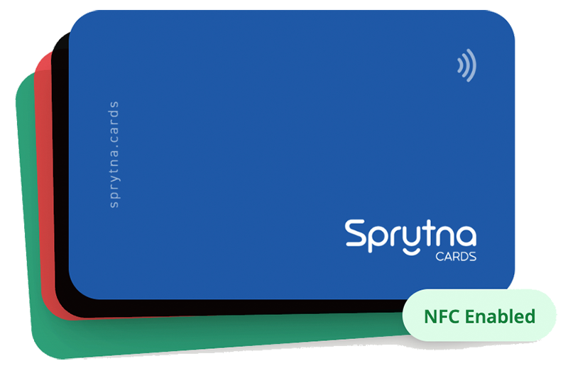

+++
title = 'Hello Sprytna Cards!'
date = 2025-06-29T12:08:40+02:00
tags = ['elixir', 'buildInPublic', 'dev']
draft = false
summary = "It is one thing to work on a big projects with a team, another to develop something useful as a solo developer. This is my 3 month journey building Sprytna.cards, hopefully it is useful."

+++

## Intro

It is one thing to work on big project with a team (which I love), another to develop something potentially useful as a solo developer, even if it's just a **hobby project**. This post outline my 3-month journey building  [Sprytna.cards](https://sprytna.cards), a slightly smarter NFC business card.

## Why

I had just purchased a conference ticket and someone from work suggested I purchase one of those digital business cards to share contact information. I never heard of it. I did a little research and found several companies offering very nice digital cards. I just felt I could build something similar for about the same cost as their offerings.

Additionally I have been itching to build something new from scratch. Something more than a single page app, but nothing as crazy as an enterprise platform to do whatever. Building a lightweight NFC card with some basic functionality hit the sweet spot.

## Self-Imposed Constraints

I work full-time so my during-the-week hours are limited. This mostly left weekends, plus a few early morning  hours during the week to build something.

I targeted \$100  to keep the total cost under what it would cost me to purchase the same thing from an existing company.

Although not necessary, I wanted to stay within my chosen stack of Elixir/Phoenix/LiveView. If I had more time I would have liked to experiment with something I don't know yet. Maybe see you next time OCaml!

I gave myself a month to put together a prototype, something that could be used if even a very limited way.

### In short

- 30 days (roughly 40 hours) to create a useful prototype
- $100 of total development budget
- Build with Elixir/Phoenix/LiveView

## Building the Prototype

### Goals

- Research and decide on the technology needed.
- Be able to tap or scane a code a card and view a profile with a vCard download option.
- Make sure there were no inherent security blockers from Android or iPhone

It did not take long to land on both QR Codes and NFC tap technology. I ordered some very cheap writable NFC cards from Amazon. To write data to those cards I found [NFC Tools](https://apps.apple.com/us/app/nfc-tools/id1252962749), a free (although I upgraded for maybe $5) NFC writer that works on iPhone.

To view a profile and download a vCard I just needed a single webpage to download a vCard and view a profile. I used [Netlify's](https://www.netlify.com/)  free tier. On a side note the folks over at Netlify seem really nice, I hope I get to use them for some future project.

Learning the vCard spec wasn't too bad and there is a lot of sample data to get you started.

Everything worked as expected. The novelty of the tap was fun. Within the first week I had a working prototype and enough confidence that I could build something that at least me and a few friends could use.

**Total Development Cost (so far)**: $10

- $3 for a phone-based NFC writer

- $7 for 40 nfc writable cards

**Total Development Time (so far)**:  about 5 hours

## vMVP (Very Minimally Viable Product)

I settled in on getting a working version that supports multiple users up as quick as possible. I even decided to partner up with a printer to professionally create some branded and custom NFC cards. Each card was uniquely written with an ID and the corresponding QR code was printed on the back of each card.

I didn't want to confuse any would-be users that happened to find my site, so I removed the ability to register and put up a "waitlist".

I also built a very basic admin section where I could do some basic card and user management. So basic actually that I couldn't even delete users yet!

The **big idea** was to allow each users to have multiple cards and multiple profiles, mixing as they needed. This meant a user with a single card could have multiple profiles and switch which profile would be visible on a tap. This made it easy to use the same card for a conference, then switch the profile for some other use.

The profile management form, still a work in progress, took a lot of time. Being able to upload images, then resize them, change background colors, edit data etc. It was both basic, a little too expansive, but usable enough for this stage of development.

As I handed out the cards to friends and family I quickly learned 4 things

1. Some users didn't want a profile. They just wanted someone to tap their card to open their Calendly/Instagram/website.
2. Some users wanted to receive contact information from other people more than they wanted to give contact information. Collect cards, not give them.
3. Profiles were being stretched into some kind of marketing website - "I want this to be my website".
4. And people **loved getting a customized card**. On a side note, this could be a business on its own.

**Total Development Cost (so far)**: $85

- $10 from previous section

- $20 Fly.io

- $55 for cards

**Total Development Time (so far)**:  about 40 hours

### Decision time

Should I continue to build out what friends and family asked for? Leave it as it it something I could use on occaison? or just kill it? I decided the worst case scenario was that I could build something that me and a few friends could reliably use - All for less than paying another company. It was enough to motivate me to move forward.

## The Road to a Wider Release

### Summary

I won't bore you with all the details. Basically it took me an additional 2 months and another maybe 100 hours to have something I am happy to generally make available to more people. The big learning at this stage was how much time was required to handle all of the (what I used to think of as) secondary concerns.

- Homepage design
- Explainer text
- Dealing with bots on a wait-list
- Building out a full admin section
- Smart image storage
- Email delivery
- Interface improvements
- etc, etc etc!

AI (Claude Code in my case) was really helpful at assisting with many of those _secondary_ details.

In the end I probably built too much (_It's an old Dean Martin recipe_ :) ) So now I am feature complete from the first batch of learnings and ready to add more people and gain more learnings.

**Features added include:**

- Configure any card to open a sprytna profile or any external url
- Add as many social (links) buttons to a profile as you like (The first version only allowed one)
- Added an option to display a share back button on the profile; allowing a user to collect contact info.
- Additional profile improvements.
- Robust admin section.

**Total Development Cost (so far)**: $150

- $85 from previous section
- $40 Fly.io (2 months)
- $25 Anthropic (Claude Code)

**Total Development Time (so far)**:  about 140 hours

A little over budget in both time and money, but I ended up doing a lot more than I originally planned. it is still in the category of a **personal hobby project**. If that changes I may write a follow-up. For now, I’m proud of what Sprytna.Cards does—and grateful for the folks who gave it a try.

## Current Status

The project is fully functional and open to additional (free) users. If you know me, feel free to reach out and I will get you on the platform and send you a card.
