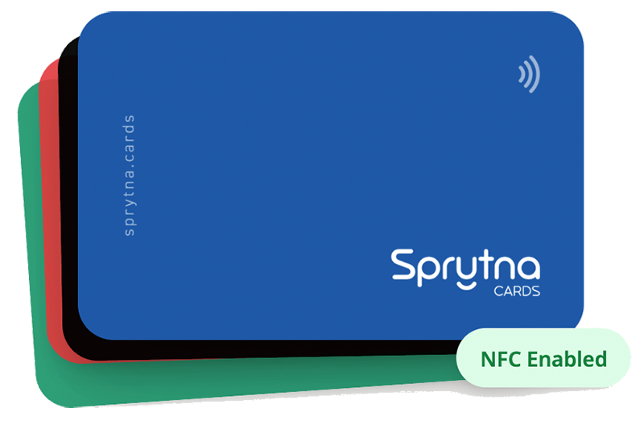

+++
title = 'I Built a Thing'
date = 2025-06-29T12:08:40+02:00
tags = ['elixir', 'buildInPublic', 'dev']
draft = false
summary = "It is one thing to work on a big projects with a team, another to go solo and see if you can still develop something useful as a solo developer. This is my 3 month journey to building Sprytna.cards"
+++





## Intro

It's one thing to work on a big projects with a team, another to see if you can still develop something useful as a solo developer. This is my 3 month journey to building [Sprytna.cards](https://sprytna.cards).

## Why

I had just purchased a software conference ticket and someone from work suggested I purchase one of those digital business cards. I never heard of it. I did a little research and found several companies offering very nice digital cards. I just felt I could build something similar for about the same cost as their offerings.

Additionally I have been itching to build something new from scratch. Something more than a single page app, but nothing as crazy as an enterprise platform to do whatever. Building a lightweight NFC card with some basic functionality hit the sweet spot.

## Self-Imposed Constraints

I work full-time and will not do anything to jeopardize my working hours. This only left weekends and a few hours during the week to make progress.

I want to keep the total cost under what it would cost me to purchase a card and their service, so under $100.

Although not necessary, I wanted to stay within my chosen stack of Elixir/Phoenix/LiveView. If I had more time I would perhaps experiment in a language/stack I haven't worked with before. Maybe see you next time OCaml.

I gave myself a month to put together a prototype and enough extras that someone could actually use it in a real-world scenario.

### In short

- 30 days (roughly 40 hours) to create the prototype
- $100 of total budget
- Build with Elixir/Phoenix/LiveView

## Prototype

### Goals

- Research and land on a technology
- Be able to tap a card and view a profile with a vCard download option
- Be able to scan a code and view a profile with a vCard download option
- Make sure there were no inherent security blockers from Android or iPhone
- Prototype as quick and as cheap as possible

It did not take long to land on both QR Codes and NFC tap technology. I ordered some very cheap writable NFC cards from Amazon. To write to those cards I found [NFC Tools](https://apps.apple.com/us/app/nfc-tools/id1252962749), a free (although I upgraded for maybe $5) NFC writer.

To view the profile and download the vCard I just needed a single webpage where the tap/scan would open a static profile and a button to download a vCard. I used [Netlify](https://www.netlify.com/) and their free tier to host that one static page. On a side note the folks over at Netlify seem really nice, I hope I get to use them for some future project. Learning the vCard spec wasn't too bad and there is a lot of sample data to get you started.

Everything worked as expected. The novelty of the tap was fun for the people. Within the first week I had a working prototype and enough confidence that I could build something people would at least have a little fun with.

**Total Cost (so far)**: $10

- $3 for a phone-based NFC writer

- $7 for 40 nfc writable cards

**Total Time (so far)**:  about 5 hours

## vMVP (Very Minimally Viable Product)

Here the process of talking with real-world potential users started. I had started with a vague idea around a dynamic configuration; that a single card should be able to open different profiles.

I settled in on getting a working version of the basic idea up as quick as possible. I ended up partnering with a printer to professionally create some NFC cards (with a couple custom-branded cards). Each card was uniquely identified with an ID and the QR code was printed on the back of each card.

I didn't want users to just sign-up at this point so I put up a wait-list form and removed the ability to register. I had a very basic admin section where I could create new users but I couldn't even delete users from the admin yet.

I added multiple cards and multiple profiles to some test accounts. A user could now edit their profile with a basic form. They could also select which profile each card would open. It was basic, but usable in the real-world.

It did not take long to learn 3 important things.

1. Some users would like to bypass their profile and link directly to their Calendly/Instagram/website.
2. Some users wanted to receive contact information from other people more than they wanted to give contact information. Collect cards, not give them.
3. Profiles were either not interesting, or overly interesting "I want this to be my website" for example.

**Total Cost (so far)**: $85

- $10 from previous section

- $20 Fly.io

- $55 for cards

  **Total Time (so far)**:  about 40 hours

### Decision time

Was there enough information to move forward to a full beta? No, there wasn't. But I went forward anyway because I really wanted to see what this product could be with the additional learnings.

## The Road to Full Beta

### Summary

I won't bore you with all the details. Basically it took me an additional 2 months and another maybe 100 hours to have something I am happy to release as beta. The big learning was how much time was required to handle all of the (what I used to think of as) secondary concerns.

- Homepage design
- Explainer text
- Dealing with bots on a wait-list
- Building out a full admin section
- Smart image storage
- Email deliver
- Interface improvements
- etc!

AI (Claude in my case) was really helpful at assisting with many of those secondary details.

In the end I probably built too much (_It's an old Dean Martin recipe_ :) ) but it was increasingly difficult to get users to interact with the product without the additional features. So now I am feature complete from the first learning and ready for the next batch of "If it only did..."

Big feature adds included:

- Configure any card to open a profile or any other url.
- Add as many social (links) buttons to a profile.
- Added an option to display a share back button on the profile, so the user can receive contact info.
- Some additional configuration on the profile (change background color).
- Robust admin section.
- I did not implement the ability to use the profile page as a user's "website"

**Total Cost (so far)**: $150

- $85 from previous section
- $40 Fly.io (2 months)
- $25 Anthropic (Claude Code)

**Total Time (so far)**:  about 140 hours

A little over budget in both time and money, but I ended up doing a lot more than I originally planned. I still don’t know if this is just a personal hobby project or something other's could also use. Maybe I’ll write a follow-up when I figure that out. For now, I’m proud of what I’ve built—and grateful for the folks who gave it a try.
