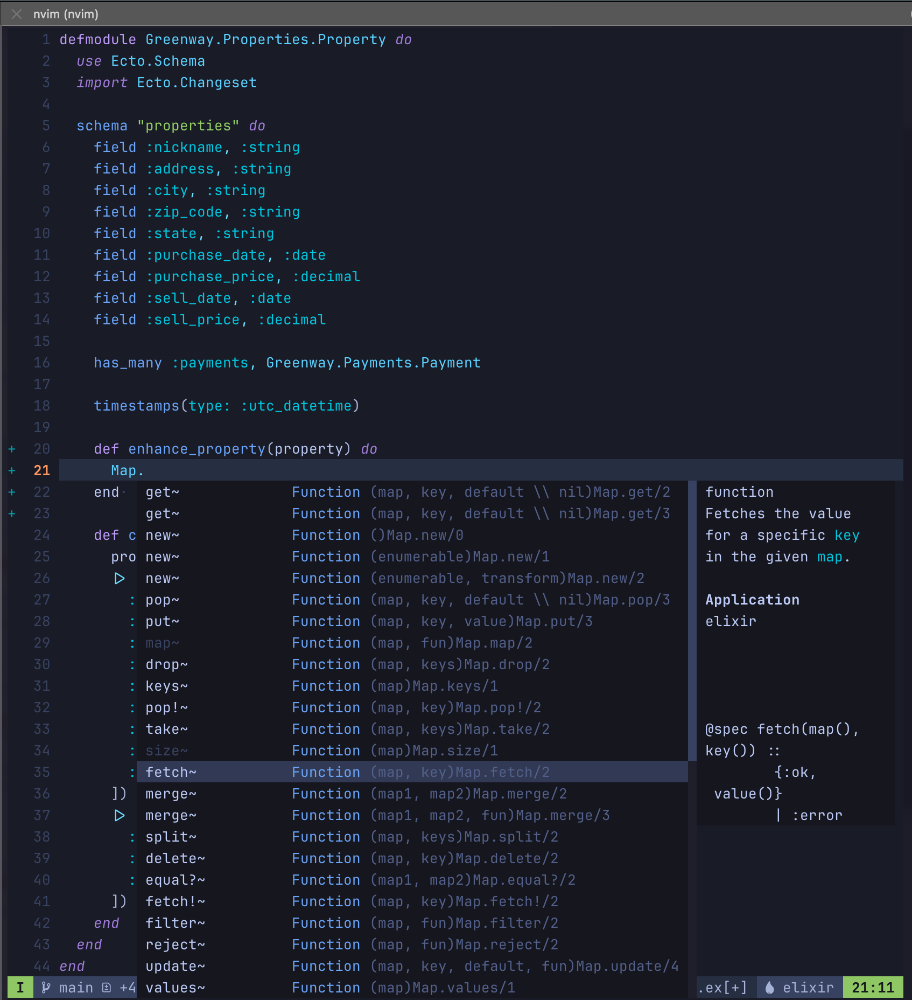

+++
title = 'Neovim and Elixir-ls Noob Edition'
date = 2024-08-10T18:01:04+02:00
tags = ['nvim', 'elixir', 'dev']
draft = false
summary = "The following is what I did, as a noob in the Vim ecosystem, to configure Neovim as my daily editor for Elixir development." 
+++


The following is what I did, as a noob in the Vim ecosystem, to configure Neovim as my daily editor for Elixir development. 


> There should be one -- and preferably only one -- obvious way to do it
>
> -- <cite>The Zen of Python</cite>

## Context

All of my attempts to adopt Vim as my daily editor ended in frustration. Endless configuration options and no clear path for the beginner (like me) to have Neovim just work. I wanted a "Zen of Python" approach to Vim setup and configuration, but I kept getting Perl versions (there should be **no** clear correct way to do something -- *citation needed*). 

My attempts included: 
- Reading through Neovim's documentation
- Watching ThePrimeagen's videos
- Installing several "distributions" like LunarVIM
- Trying Evil mode (Emacs with Vim keys) 

With each attempt I would hit some _magic_ or complexity that I didn't understand and couldn't figure out how to override. On the occasion that things worked, some little update/change would break my configuration and the rest of the day was spent fixing it. 

## A New Way Forward

### The Kickstart I Needed

[kickstart.nvim](https://github.com/nvim-lua/kickstart.nvim) spoke to me. Not a distribution, but a "starting point for Neovim that is: Small, Single-file, Completely Documented". I watched [the video](https://www.youtube.com/watch?v=m8C0Cq9Uv9o) and if there was a T-shirt I probably would have bought it as well. With new hope, I went to work. 

I blew away any lingering Vim configuration files on my mac and went through the very easy [setup process for Kickstart.nvim](https://www.youtube.com/watch?v=m8C0Cq9Uv9o). My initial impressions were good, but I had some intellectual baggage from my other Vim experiences that got in my way. For example, I created a new elixir file and expected some magic to kick in, and when it didn't I was both confused and hopeful. 

### Lazy

Kickstart.nvim comes with a single configuration file that uses [Lazy.nvim](https://github.com/folke/lazy.nvim) to manage plugins. By modifying the included single file `~/.config/nvim/init.lua`, you can control just about everything. Change the file, then Vim command `:Lazy` *(I)nstall*. Also give Lazy a health check by running the Vim command `:checkhealth lazy` and follow the recommendations. The only issue I had was that _elixir-ls_ wouldn't start.  

### The Important Places

I found some cruft going through `~/.config/nvim` and `~/.local/*` that I needed to get rid of that was conflicting with my new install (I think). I also came across Mason which turned out to be the key utility I needed to get elixir-ls installed and available to my configuration.   

### Mason-ery

[Mason](https://github.com/williamboman/mason.nvim) takes care of managing the dependencies for Neovim configurations. In my case I had to delete my existing elixir-ls files and re-install them using the Vim command `:MasonInstall elixir-ls`. With all the pieces in place, and old pieces removed, I got everything working to my delight. 

The following is the short process I followed on my other macs to get everything working. Hopefully they will work for you. 

## Setup Neovim with Elixir-ls

1. Follow the [install steps](https://github.com/williamboman/mason.nvim) for kickstart.nvim
2. Edit your `~/.config/nvim/init.lua`
3. Install elixir-ls with Mason. 

### 1. kickstart.nvim

Just follow the [directions from kickstart.nvim](https://github.com/nvim-lua/kickstart.nvim?tab=readme-ov-file#installation). I am not sure how valuable forking the repository is, but everything else made sense to me. Especially make sure you remove (or move) your previous Vim configuration files and packages from `~./config/nvim` and `~/.local/share`, `~/.local/bin`, `~/.local/state`.

### 2. Edit your init.lua file
Edit your `~/.config/nvim/init.lua`. Yep, it's okay! If something goes wrong just reset it back to the original file. 

Add `elixirls = {}`  under `local servers = {...`

```lua
      local servers = {
        -- clangd = {},
        -- gopls = {},
        -- pyright = {},
        -- rust_analyzer = {},
        -- ... etc. See `:help lspconfig-all` for a list of all the pre-configured LSPs
        --
        -- Some languages (like typescript) have entire language plugins that can be useful:
        --    https://github.com/pmizio/typescript-tools.nvim
        --
        -- But for many setups, the LSP (`tsserver`) will work just fine
        -- tsserver = {},
        --
        elixirls = {},
        lua_ls = {
```
And then apply your changes with `:Lazy` and `(I)nstall`.

### 3. Install elixir-ls with Mason

Enter the Vim command `:MasonInstall elixir-ls` and you should get some quick feedback that elixir-ls was installed. 

### Go Code!

Now when you open/create your next elixir file it should look a little like below - with all the Elixir bells and whistles!



### Some Handy IDE Commands

A few commands that I found helpful working with Neovim as an IDE. 

**Search**

`SPC s h` Help documentation

`SPC s f` Search all files

`SPC d s` Search symbols

**Navigating code hint**

`CTRL n` Next

`CTRL p` Previous

`CTRL y` Select

**Go to commands**

`g;` Go to previous changes

`g,` Go to newer changes

## Happy Coding!

Of course this is just the start of working with Neovim, but it is a solid foundation that is highly usable. A solid platform for your own self-learning and experimentations. 

## Feedback

I hope you found this post helpful. Feel free to [DM on Twitter @mkumm](https://twitter.com/mkumm) email me at [mike @ mkumm.com](mailto:mike@mkumm.com) with any feedback or questions.
