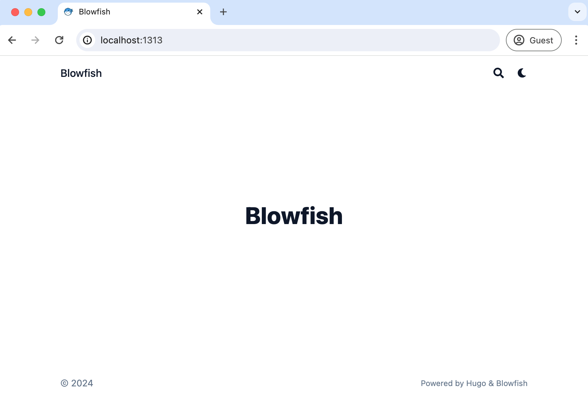
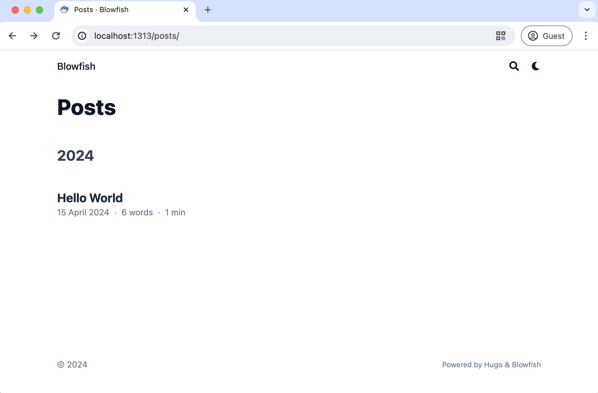
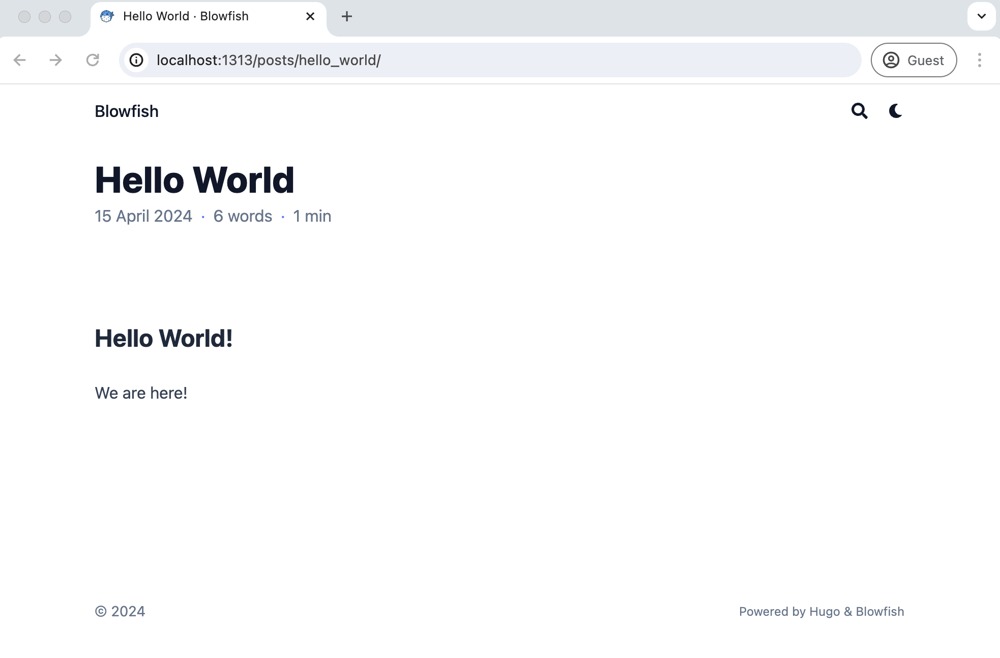
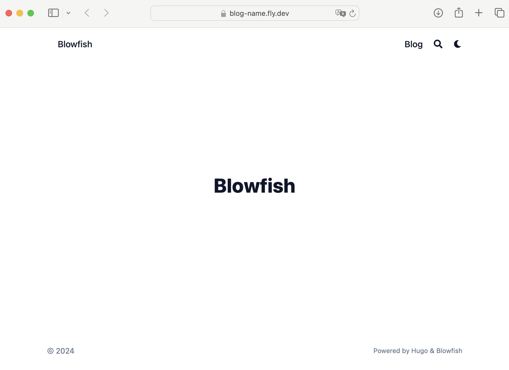
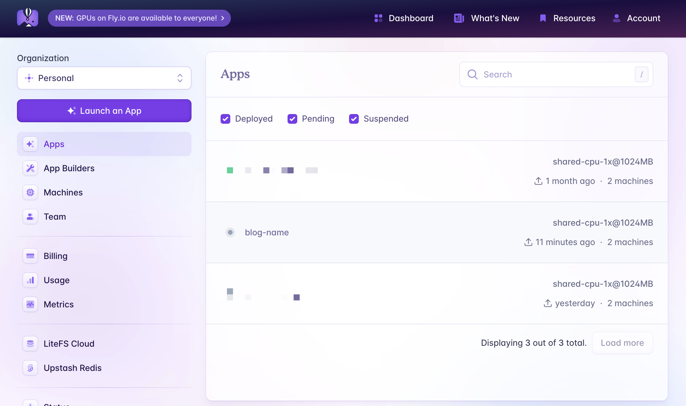
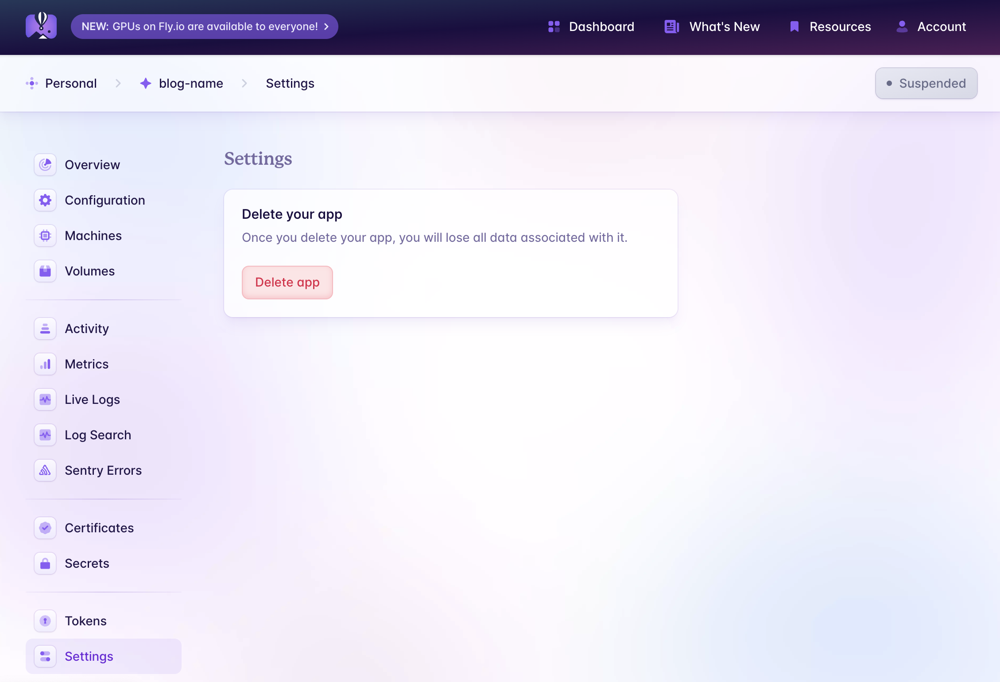

+++
title = 'Up and Running With Hugo'
date = 2024-04-15T12:40:00+01:00
tags = ['go', 'dev', 'blog', 'hugo', 'blowfish']
draft = false
summary = "A straightforward 'up and running' guide for hosting a static site using Hugo, Blowfish, and Fly.io. designed for individuals with basic technical skills."
+++


As an advocate for content ownership, I believe we can use major platforms effectively to amplify our voice while maintaining control - To support this, I've crafted a straightforward "up and running" guide designed for individuals with basic technical skills.


This post is mostly about setting up [Hugo](https://gohugo.io/) and [Blowfish](https://blowfish.page/) deployed to [Fly.io](https://fly.io/). Feel free to jump to the [Hugo Quickstart](#hugo-quick-start) portion and skip the backstory.

## Backstory

### Why Hugo?

_I want to..._

- use a platform that I didn't have to think about once I set it up.
- write in [markdown](https://daringfireball.net/projects/markdown/syntax).
- own my content and cross post to other platforms.
- use my own domain name.
- have creative control but start with something sensible.

### Considerations

I looked at Ghost, Medium, Squarespace, Dev.to, and several other platforms that 'just let me start posting.' None of these granted me the freedom to quickly move to a different platform if they decide to change pricing or add policies that I don't like.

I did spend about an hour considering writing my own blogging software (maybe in C) but eventually decided that I didn't want to [shave a yack](https://en.wiktionary.org/wiki/yak_shaving) before I started writing blog posts (maybe later). My search led me to [static site generators](https://en.wikipedia.org/wiki/Static_site_generator) which brought me to the usual players: [Gatsby](https://www.gatsbyjs.com/), [Jekyll](https://jekyllrb.com/), [Hugo](https://gohugo.io/) and others - I feel like I tried them all.

### Hugo For the Win!

My first impression using Hugo was that it was fast. I mean really, really fast. Much faster then working in my usual web stack (Elixir/Phoenix). Hugo also comes with a nice collection of starter templates and themes (I chose Blowfish). In pretty short time I had a working prototype. I am super happy with Hugo and Blowfish, but even if I change my mind later my content is all plain-text [markdown](https://www.markdownguide.org/basic-syntax/) so I can pretty much just move it to a different platform.

## Hugo Quick Start

The following is a step by step guide for setting up and configuring Hugo with Blowfish.

### Prerequisites and Assumptions

Generally I assume you are using a Mac (or Unix-like operating system) with [homebrew](https://brew.sh/) already installed (or you are comfortable installing packages in an alternate way). If you are on a PC, you are on your own to modify some of the instructions for your platform.

The instructions below also assume you have [git](https://git-scm.com/), [node](https://nodejs.org/en), and [GO](https://go.dev/) already installed and optionally [Docker](https://www.docker.com/). If you don't have these installed yet, you will need to do that before moving on. You should also know basic terminal commands and be comfortable with a text editor like [VIM/NVIM](https://neovim.io/), [VScode](https://code.visualstudio.com/), or my favorite [Zed](https://zed.dev/).

### Install Hugo and Blowfish

There are a lot of options when choosing how to install Hugo and Blowfish, the following method is the easiest and fastest and I did not run into any problems later in the process.

```console
$ brew install hugo
```

Navigate to wherever you want to setup your blog on your local system and run the following commands. Replace `blog-name` with the name of your blog. I used `mkumm-blog` from my `Dev` directory.

```console
# This will be the root of your blog
$ hugo new site blog-name

$ cd blog-name
```

```console
# from blog-name/
$ git init

$ git submodule add -b main https://github.com/nunocoracao/blowfish.git themes/blowfish
```

I ignored all of the Blowfish install tools and any alternative methods of installation. Using the submodule option puts you in a good place later on.

### Add Your Basic Config

We need to copy our `blog-name/themes/blowfish/config` directory to the root of our project and make one small edit to `hugo.toml`.


```console
blog-name
├── archetypes
├── assets
├── content
├── data
├── hugo.toml
├── i18n
├── layouts
├── public
├── static
└── themes
    └── blowfish
    	└── config # <- copy this directory
    		└── _default
```


```console
$ cp -r themes/blowfish/config .
```

```console
blog-name
├── archetypes
├── assets
├── content
└── config # the directory you just added
    └── _default
├── data
├── hugo.toml
├── i18n
├── layouts
├── public
├── static
└── themes
```

In your favorite text editor, uncomment the themes entry (line 5) of `blog-name/config/_default.hugo.toml`.

The start of `hugo.toml` should now look like this.

```toml
# editing blog-name/config/_default/hugo.toml

# -- Site Configuration --
# Refer to the theme docs for more details about each of these parameters.
# https://blowfish.page/docs/getting-started/

theme = "blowfish"
# baseURL = "https://your_domain.com/"
defaultContentLanguage = "en"
.
.
.
```

### Launch Your Local Server

After saving `blog-name/config/_default/hugo.toml` run the following:

```console
# from blog-name/

$ hugo server
```

Now take a look at [localhost:1313](http://localhost:1313) in your browser.



### What We Did

By adding the Blowfish git submodule to our system, we ended up with a sub-directory called `themes/blowfish`. Consider this a **read only** directory. You do not want to edit files directly in the `themes/blowfish/` directory.

When Hugo is looking for a file it needs, it will first look in _your_ files, which is pretty much everything but your themes directory. If Hugo can't find the file it needs, it will then search for that file in your configured theme files. This is what we did when we edited hugo.toml.

When we ran the command `hugo server` we asked Hugo to launch a basic web server suitable for development and dynamically generate the static files needed to serve your blog on port 1313. As you might imagine, there are a lot of options available - well documented on the [Hugo Documentation Site - Hugo server](https://gohugo.io/commands/hugo_server/).

**Spoilers** To actually build your site for production, the command is even shorter `hugo`.

And that's all it takes to set up a bare bones Hugo Server with a custom  theme. Let's create our first blog post.

## First Blog Post

In the documentation you will see there are many options for how you can set up your files for your blog. To get started, let's keep it as simple as possible and leave customizations for later.

### Hello World

Let's use Hugo's built in generators to give us a markdown file with helpful front matter. That is just a fancy way of asking Hugo to set up a new post for us.

```console
$ hugo new content posts/hello_world/index.md
```

This will create a new directory `content/posts/hello-world/index.md` with a markdown file which we will use to create our first blog post.

```text
# content/posts/hello-world/index.md

+++
title = 'Hello_world'
date = 2024-04-15T22:20:02+02:00
draft = true
+++
```

The text between the two `+++`s is our _front matter_ which is not directly visible in our post. Let's edit this file so we can see our post in a browser. By default, Hugo will not show posts with `draft = true`

```text
# content/posts/hello-world/index.md

+++
title = 'Hello World'
date = 2024-04-15T22:20:02+02:00
draft = false
+++

## Hello World!

We are here!
```

We edited our _front matter_ to give us a human looking title and changed draft from `true` to `false` as well as adding the obligatory "Hello World!" text. Once we save the file we can see our post added to our list of posts (which of course just has one at the moment): [localhost:1313/posts/](http://localhost:1313/posts/)



You can view the entire post by clicking on the listing. [localhost:1313/posts/hello_world](http://localhost:1313/posts/hello_world)



Looks great, but if we are starting from the home page, we will never find our posts. Let's fix that.

### Add "Blog" To Site Menu

Let's make one last edit so we have a link on our homepage to our posts. Uncomment lines 13-16 in `config/_default/menus.en.toml` so it looks like this

```toml
# -- Main Menu --
# The main menu is displayed in the header at the top of the page.
# Acceptable parameters are name, pageRef, page, url, title, weight.
#
# The simplest menu configuration is to provide:
#   name = The name to be displayed for this menu link
#   pageRef = The identifier of the page or section to link to
#
# By default the menu is ordered alphabetically. This can be
# overridden by providing a weight value. The menu will then be
# ordered by weight from lowest to highest.

[[main]]
 name = "Blog"
 pageRef = "posts"
 weight = 10

#[[main]]
#  name = "Parent"
#  weight = 2
.
.
```

We are telling Hugo to add "Blog" to our navigation and have it point to our "posts" content folder. When you save the above file, make sure your server is running (you can start it by running `$ hugo server`) and click into your local [homepage](http://localhost:1313) to see that a navigation link to your posts are now visible from the home page.

### What We Did

We used the Hugo Generator to create a directory for our blog post and edited the `index.md` file to create our post. Technically we don't need to create a directory for every post, but with a directory we can add images, video, whatever to the directory and we can reference those files conveniently with a little markdown ``. Notice the lack of `../static/to/image/`, your images (or music, videos, etc) are just there. You also have the option of storing your images globally in your assets directory if you need the same resource in multiple places on your site.

We edited our `config/_default/menus.en.toml` file to start to build out our navigation. If you explore that file (and other toml files) you see start to see how much control we have just by editing configuration files.

Now is a good time to start exploring the sample blowfish site in `themes/blowfish/exampleSite` for inspiration on what is possible out of the box. By the way that example site is already up and running - it's the same one used on
[Blowfish Website](https://blowfish.page/)

At this point you have enough information to start developing your blog on Hugo/Blowfish. The next section will cover building your static site and publishing it on [fly.io](https://fly.io) (other examples/hosting solutions are well documented on the [Hugo site](https://gohugo.io/hosting-and-deployment/)).

## Build and Deploy

So far we have updated some configuration files, added a theme, and temporarily rendered our content to view on our local browser. The next step will create a "permanent for now" version of our static site.

Let's build our static site.

### Build

```console
$ hugo
```

Yep, that's it. Our `public/` directory is now populated with everything you will need (and at the moment more than you need) to deploy your site.

### Prep for Deployment

Hugo's `hugo deploy` (with some minimal configuration) can be used to deploy to all the regular players and it is a great option. What is not well documented is setting up a more generic deployment using Docker and a provider like [fly.io](https://fly.io) - which is the provider I have been using for the last year or so.

**Set up a Docker File**

Create a new file named `Dockerfile`

```console
# from blog-name

$ touch Dockerfile
```

Edit `Dockerfile` so the entire file looks like this

```txt
FROM pierrezemb/gostatic
COPY ./public/ /srv/http/
```

**Just for fun**

This next step is optional, feel free to skip and go to [Time to Fly.io](#time-to-flyio).

Assuming you have docker on your local system.

```console
# from ~/Dev/blog-name/
$ docker build -t myblog .
```

Once built, you can launch your blog with

```console
$ docker run -d -p 80:8043 myblog
```

Because the server we chose uses port 8043, we just need to redirect requests to the right ports.

Now you can go to your [localhost](http://localhost) and see your full static site as it will be deployed on the web.

### Time to Fly.io

**Set up Fly.io cli tools**

If you don't have an account yet, go to [fly.io/docs/hands-on/install-flyctl/](https://fly.io/docs/hands-on/install-flyctl/) to set up `flyctl` and follow the first two steps from their website. (I have no affiliation and receive no incentives from Fly.io).

Once you have created your Fly.io account and installed `flyctl` deployment is just a couple steps.

**Create your fly.toml file**

Fly.io will need some information from us to be able to configure their resources to host our blog. We are going to let flyctl create the initial version of this for us. Run the following command.

```console
$ flyctl launch
```

You will be asked two questions, just answer 'N' in both cases
- _Do you want to 'tweak' these settings?_. **N**
- _Do you want to add dockerignore...?_. **N**

Fly will continue to launch your site, but it won't actually work yet. Let's fix that by updating the `fly.toml` file that was just created for us.

```toml
1  # fly.toml app configuration file generated for blog-name on 2024-04-17T11:43:28+02:00
2  #
3  # See https://fly.io/docs/reference/configuration/ for information about how to use this file.
4  #
5
6  app = 'blog-name'
7  primary_region = 'waw'
8
9  [build]
10
11 [http_service]
12  internal_port = 8080
13  force_https = true
14  auto_stop_machines = true
15  auto_start_machines = true
16  min_machines_running = 0
17  processes = ['app']
18
19 [[vm]]
20  memory = '1gb'
21  cpu_kind = 'shared'
22  cpus = 1
```

We need to update our internal port on line 12 from "8080" to "8043" so it looks like this the text below. The other settings will be different from the sample above.

```toml
11 [http_service]
12  internal_port = 8043
13  force_https = true
14  auto_stop_machines = true
15  auto_start_machines = true
16  min_machines_running = 0
17  processes = ['app']
```

No we can run...

```console
$ flyctl deploy
```

After waiting for some behind the scenes magic... follow the link it provides to view your newly-published public-to-the-world blog! 🎉



### Destroy App

Fly.io let's you use up to $5 (might be $10) of resources for free each month so this blog won't cost us anything if we let it run for a while, but there is probably no reason to keep this running... so...

Go to your [Fly.io Dashboard](https://fly.io/dashboard) and click on your new App. If this is your first time using Fly, it will be the only App listed.



Then scroll to the bottom of the page and click "Settings", this will give you the option to "Delete app"



Click "Delete app" and after a confirmation step, your app has been deleted and you won't see any charges.

## Next Steps

### Configuration

Get to know your `config/_default` files. Experiment and see how much you can modify on your site before you add any new design elements. Social links, blog name, layout options, etc. etc. are all managed through your configuration files.

[https://blowfish.page/docs/getting-started/](https://blowfish.page/docs/getting-started/)

### Add Some Style

Get some inspiration from the [Blowfish Samples page](https://blowfish.page/examples/) and then start playing around with different layouts [https://blowfish.page/docs/homepage-layout/](https://blowfish.page/docs/homepage-layout/)

### Configure TailwindCss to Reload on Change

Sadly you don't start with access to everything that TailwindCSS has to offer. Basically if a Tailwind element is not currently being used in your site, you won't have access to that element until you "rebuild your css". To do this frequently you will need to do 2 things.

1. Install the Tailwind compiler

```console
$ cd themes/blowfish
# and then from themes/blowfish run
$ npm install
```

Running this command will give you access to tailwind's tools which you will need to rebuild your css.

```console
# Get back to the root of your site
$ cd ../..
# and then run
$ ./themes/blowfish/node_modules/tailwindcss/lib/cli.js -c ./themes/blowfish/tailwind.config.js -i ./themes/blowfish/assets/css/main.css -o ./assets/css/compiled/main.css --jit -w
```
This second command will start a watcher on your site and will update your CSS whenever you make a change to the code that requires new css elements.

### Add General Pages (Contact, etc)

Take a look at the Blowfish [content-examples](https://blowfish.page/docs/content-examples/) to learn how to add pages that are not blog posts (like Contact, A Photo Gallery, etc.) to your site.

### Careful between development and production

When you run `hugo server` the files in `public/` will be generated based on your development environment. For example your internal links will point to your localhost, not your online website. Your `robots.txt` file, your instructions to search engines, will be configured to disallow access to your site so google will not include your site in search results.

**SO** right before you push your website up, make sure to always run `hugo` and then `flyctl deploy`

```console
$ hugo
Start building sites …
hugo v0.124.1-db083b05f16c945fec04f745f0ca8640560cf1ec+extended darwin/arm64 BuildDate=2024-03-20T11:40:10Z VendorInfo=brew


                   | EN
-------------------+-----
  Pages            | 34
  Paginator pages  |  0
  Non-page files   | 14
  Static files     | 10
  Processed images | 32
  Aliases          |  9
  Cleaned          |  0

Total in 93 ms

$ flyctl deploy
```

## Feedback

 I hope you found this post helpful. Feel free to [DM on Twitter @mkumm](https://twitter.com/mkumm) email me at [mike @ mkumm.com](mailto:mike@mkumm.com) with any feedback or questions.
